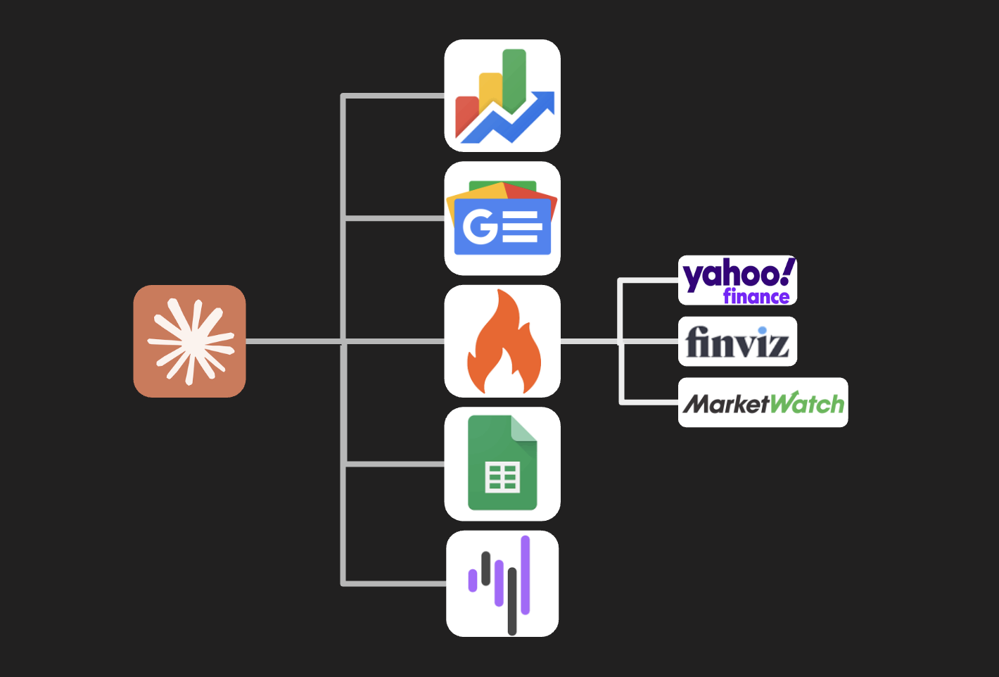

<p align="center">
   
</p>

# Stock Portfolio Agent

A stock research and portfolio management agent built with the [Arcade](https://arcade.dev) tool platform. Exposes tools as an MCP server (for Claude Desktop or other MCP clients) and includes a standalone terminal agent you can chat with directly.

## What it does

- **Market research** — real-time stock prices and analyst sentiment via Google Finance, fundamentals and technicals via Finviz, trending tickers via Yahoo Finance, and market/stock news via Google News and MarketWatch
- **Portfolio management** — track holdings and transactions in a Google Sheet; add, remove, and refresh positions
- **Terminal agent** — chat with Claude in your terminal; it decides which tools to call and returns a synthesized answer

## Prerequisites

- Python 3.10+
- [uv](https://docs.astral.sh/uv/getting-started/installation/)
- An [Arcade](https://arcade.dev) account and API key
- An [Anthropic](https://console.anthropic.com) API key (for the terminal agent)
- A Google Sheet (see step 5 below)

## Setup

### 1. Install the Arcade CLI

```bash
uv tool install arcade-mcp
```

### 2. Log in to Arcade

```bash
arcade login
```

Follow the browser prompt to connect your terminal to your Arcade account.

### 3. Clone and install

```bash
git clone <repo-url>
cd finance_agent/my_server
uv sync
```

### 4. Configure environment variables

Copy the example env file and fill in your keys:

```bash
cp .env.example .env
```

Open `.env` and set:

```
ARCADE_API_KEY=        # from arcade.dev dashboard
ARCADE_USER_ID=        # your email address registered with Arcade
ANTHROPIC_API_KEY=     # from console.anthropic.com
GOOGLE_SHEETS_ID=      # the ID from your Google Sheet URL
```

### 5. Authorize tools in the Arcade platform

In the [Arcade dashboard](https://arcade.dev), authorize the following toolkits before running the agent:

- **Google Sheets** — required for portfolio tools (read/write holdings and transactions)
- **Google Finance** — required for live stock prices
- **Google News** — required for news search
- **Firecrawl** — required for scraping MarketWatch, Finviz, and Yahoo Finance

For Google Sheets specifically, the terminal agent will also prompt you to complete the OAuth flow on first run if it detects authorization is missing.

### 6. Set up the Google Sheet

Click the link below to copy the portfolio template to your Google Drive:

**[Use Portfolio Template](https://docs.google.com/spreadsheets/d/1DV8sJpltHBYdjTt6tywi24SU0p0_3tzteA3FY4C6n5c/template/preview)**

Once you have your copy, grab the sheet ID from the URL:

```
https://docs.google.com/spreadsheets/d/THIS_IS_YOUR_SHEET_ID/edit
```

Paste that ID as `GOOGLE_SHEETS_ID` in your `.env`.

## Running the terminal agent

```bash
cd my_server
uv run python agent.py
```

You can then ask things like:
- *"What's the price of NVDA?"*
- *"What's the market doing today?"*
- *"Add 10 shares of AAPL to my portfolio"*
- *"Show me my holdings and refresh prices"*

## Running as an MCP server

To use the tools inside Claude Desktop, first register the server with Arcade:

```bash
cd my_server
arcade configure claude
```

This automatically updates your Claude Desktop config. Then start the server:

```bash
uv run python -m finance_tools.server stdio
```

## Available tools

*`—` = yfinance only (no Arcade toolkit required)*

| Tool | Description | Arcade Tools |
|---|---|---|
| `get_stock_overview` | Live price, daily change, and recent news for a stock | `GoogleFinance.GetStockSummary` |
| `get_sentiment` | Analyst consensus rating and score | — |
| `get_stock_news` | Recent news headlines for a specific ticker | — |
| `get_stock_profile` | Full fundamentals and technicals (valuation, growth, Finviz data) | `Firecrawl.ScrapeUrl` |
| `get_news` | Headlines from Google News and MarketWatch for any topic | `GoogleNews.SearchNewsStories`, `Firecrawl.ScrapeUrl` |
| `find_trending_tickers` | Most active stocks right now (scrapes Yahoo Finance) | `Firecrawl.ScrapeUrl` |
| `read_holdings` | Current portfolio positions from Google Sheets | `GoogleSheets.GetSpreadsheet` |
| `add_holding` | Add a position and log the transaction | `GoogleSheets.GetSpreadsheet`, `GoogleSheets.UpdateCells` |
| `remove_holding` | Remove a position and log the sale | `GoogleSheets.GetSpreadsheet`, `GoogleSheets.UpdateCells`, `GoogleSheets.WriteToCell` |
| `refresh_portfolio` | Refresh live prices and recalculate gain/loss for all holdings | `GoogleSheets.GetSpreadsheet`, `GoogleSheets.UpdateCells`, `GoogleSheets.WriteToCell` |
| `read_transactions` | Full buy/sell transaction history | `GoogleSheets.GetSpreadsheet` |

## Project structure

```
my_server/
  agent.py                  # terminal agent loop
  src/finance_tools/
    __init__.py             # MCPApp instance
    server.py               # MCP server entrypoint
    research.py             # market research tools
    portfolio.py            # portfolio management tools
```
